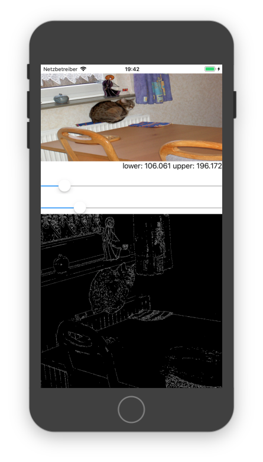

# openCVXSwift
small test project for openCV and Swift

Something like that right now:

# requirements

you need openCV (2.4) included in your project as a framework.

I used Cocoapods so you just have to run:
pod install

in your project directory.

